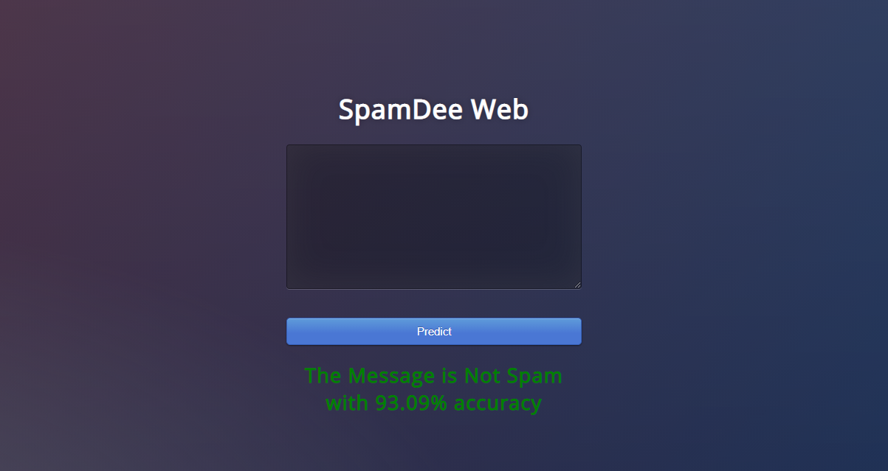
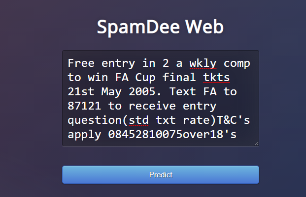
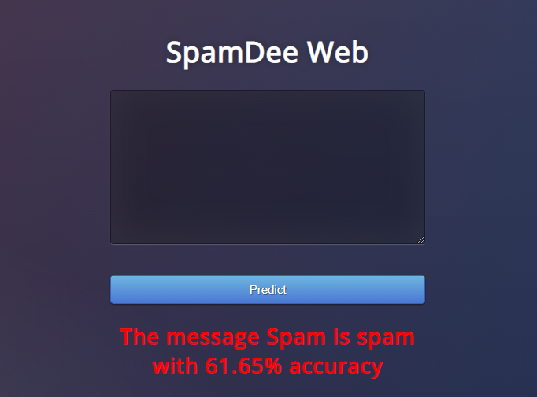
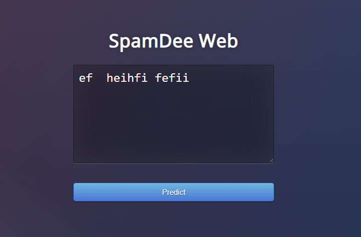
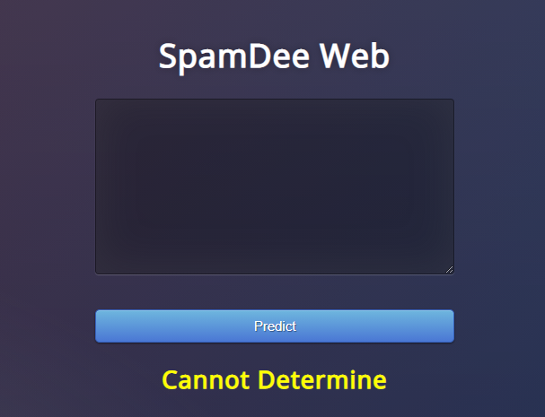

### SpamDee Web Application:
----------

App Link:  http://cashmoney22.pythonanywhere.com/

#### Description:
The web app, which uses natural language processing to classify input messages into 3 categories using Naive-Bayes Algorithm.

#### Hosting Platform:

[PythonAnywhere](https://www.pythonanywhere.com/user/cashmoney22/webapps/#tab_id_cashmoney22_pythonanywhere_com)

***Important Message:***
You'll need to log in at least once every three months and click the "Run until 3 months from today" button below. We'll send you an email a week before the site is disabled so that you don't forget to do that. See here for more details.

This site will be disabled on Monday 2 August 2021


#### Problems & Scope of Improvement:
```
- Parses through the text Database for each query,making the web app extremely slow.
- Shifting the codebase from a basic python script to using a pre-trained model for classification.
```  

#### ***1.Ham***



-----------

#### ***2.Spam***



-----------

#### ***3.Not Certain***



